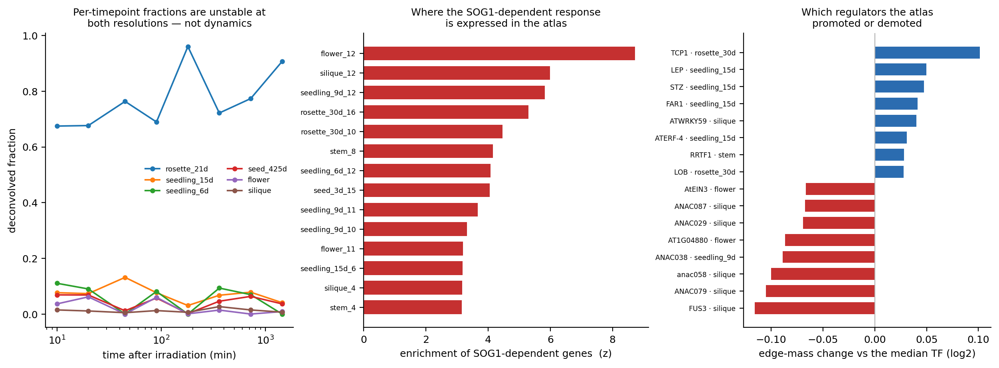
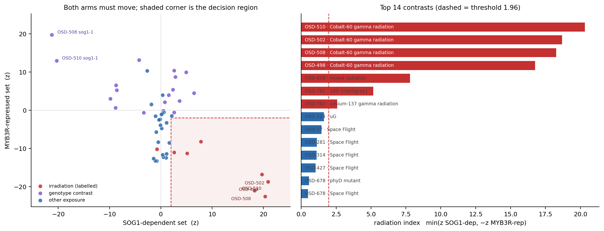
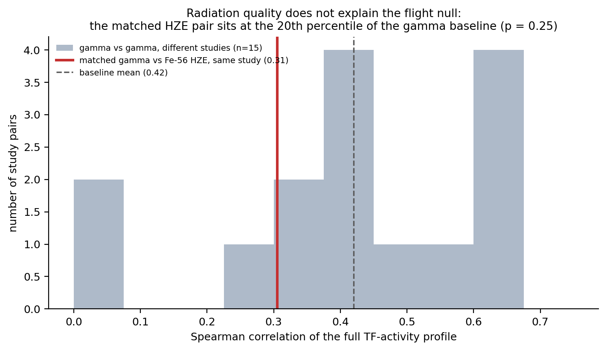
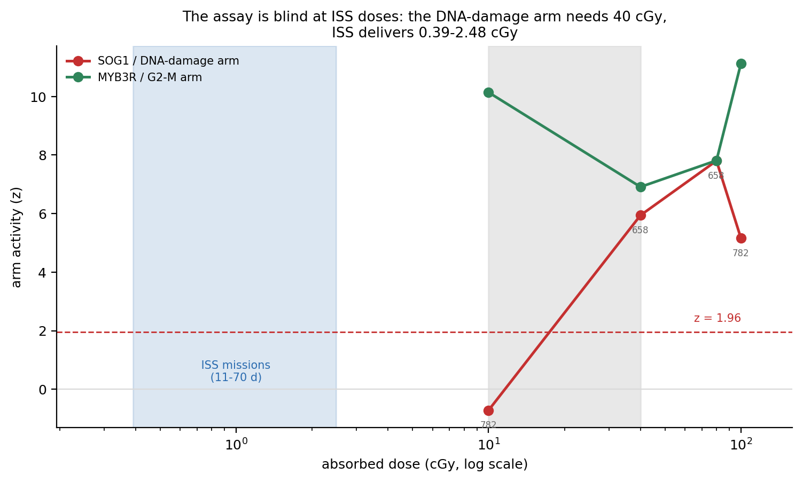
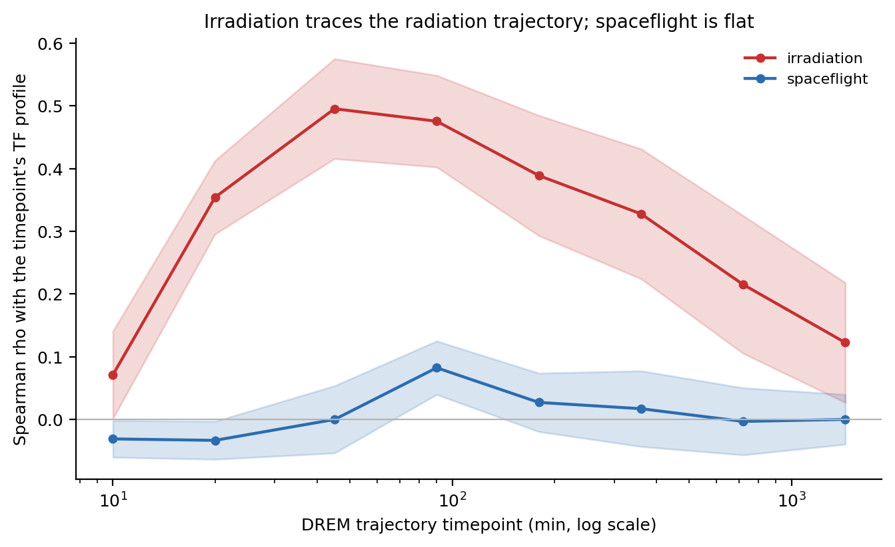

# arabidopsis-drem-osdr

Cross-study **pseudo-time-series** from NASA's Open Science Data Repository (OSDR),
modelled with the **Dynamic Regulatory Events Miner (DREM 2.0.7)**, with a single-cell
atlas acting **on the model** rather than on its annotation.

---

## What this does that DREM and iDREM do not

DREM finds bifurcations in a time-series and attributes each to the transcription factors
whose targets are enriched along one branch. That attribution depends on a static
TF–gene interaction prior which is normally **binary and tissue-blind**: an edge says a TF
*can* bind a promoter, not that the TF is present in the cells producing the signal.

iDREM accepts single-cell data, but its documentation is explicit that the cell-type data
"is not used when predicting the iDREM model" — it annotates finished nodes.

This pipeline moves that information upstream without modifying the engine. **DREM reads
the third column of its TF–gene file as a score in `[0,1]`, not as a binary flag**, and
that column is a sufficient channel: each timepoint is deconvolved against a 183-cluster
single-nucleus atlas, and every edge is re-weighted by whether its TF is expressed in the
cell types actually present.

The experiment is the ablation. Each arm is fitted three times under an identical search,
pinned seed and identical data, differing only in the prior:

| prior | column 3 | question it answers |
|---|---|---|
| `flat` | all edges `1.0` | what DREM normally gets |
| `binding` | DAP-seq / ChIP score | does binding confidence alone matter? |
| `weighted` | binding × cell-type context | does cell-type context change the attribution? |

If the weighted prior changes nothing, that is the finding and it is reported as such.

---

## The data

Screening all **62** *Arabidopsis thaliana* studies in OSDR for a parsable numeric time
axis and Illumina RNA-seq yields two cohorts. Every number below is measured by
`scripts/02_harmonise_metadata.py` and re-checked on each run, never asserted.

### Cohort A — γ-irradiation (primary)

**108 timed samples over 10 timepoints, 10 min → 72 h**, plus 36 untreated anchor samples.

| Study | Timepoints (min) | Genotypes | Role |
|---|---|---|---|
| OSD-498 | 10, 20, 90, 1440 | WT | core (`gIR vs mock wt`) |
| OSD-508 | 10, 20, 45, 90, 180, 360, 720, 1440 | WT, **sog1-1** | core (`t vs t0`) |
| OSD-510 | 20, 90, 180, 360, 720, 1440 | WT, **sog1-1** | core (`DREMmodel`) |
| OSD-782 | 60, 180, 1440, 4320 | WT | independent lab, low dose — **held out** |
| OSD-502 | — | WT, myb3r135 | repressor anchor (no time axis) |

**An honest statement of provenance.** OSD-498, OSD-508 and OSD-510 are three accessions
of *one* experiment — [Bourbousse, Vegesna & Law, *PNAS* 2018](https://doi.org/10.1073/pnas.1810582115),
who built their own DREM model over these data and reported **11 co-expressed gene
groups**. Assembling them is useful (it is how the 10 and 45 min timepoints join the 24 h
course) but it is **re-assembly, not integration**. The genuinely cross-study arm is
OSD-782 — which is also where the design is weakest, because it crosses a dose regime
(10–100 cGy against the core's high dose) and is therefore held out rather than pooled.

### Cohort B — spaceflight development (secondary)

**115 samples over 3 timepoints (4, 6, 8 d)**, four ecotypes, from OSD-193/218/281/437.
Reported as a generalisation test, not a co-equal result.

**OSD-219 is excluded**: all 32 of its BioSample IDs are identical to OSD-218's. The
duplicate is re-detected from sample-name overlap on every run rather than hard-coded, so
the exclusion cannot outlive the condition that justifies it.

---

## Results

**The response is SOG1-dependent, and the pipeline recovers that before any model is
fitted.** After batch harmonisation, all six canonical DNA-damage sentinels exceed 2-fold
induction in wild type — SMR7 rises from 1.34 (10 min) to 7.62 (3 h) and decays to 4.42
(24 h) — while in `sog1-1` only 4 reach 2-fold and RAD51 falls from 5.95 to 0.60. No step
in the harmonisation sees genotype, so this is the strongest available evidence that the
cross-study assembly measures biology rather than batch structure.


**DAP-seq does not contain SOG1.** The standard *Arabidopsis* binding atlas never assayed
the master regulator of the DNA-damage response. A DREM model built on it would produce a
complete, plausible, entirely SOG1-free attribution, and **nothing in the output would
signal the omission**. `scripts/04b_sog1_chip_prior.py` closes the gap by calling SOG1
peaks from the source study's own ChIP-seq (OSD-496 / GEO GSE112529) — 1,720 target genes,
requiring enrichment over *both* the matched input and the no-FLAG wild-type IP.
`04_fetch_tf_prior.py` now reports the presence of every key regulator on each run.

**The TF attribution reproduces the published regulatory logic.** Across all 12 models
(4 arms × 3 priors), SOG1 ranks **first of 479 scored TFs** in the wild-type model under
every prior, and collapses in the knockout:

| Prior | SOG1 rank, wild type | SOG1 rank, *sog1-1* |
|---|---|---|
| flat | **1** | 404 |
| binding | **1** | 6 |
| weighted | **1** | 574 |

MYB3R1 ranks 1–5 in wild type and is retained in the mutant, as expected for a repressor
whose activity does not depend on SOG1. This is the activator/repressor logic Bourbousse
et al. reported, recovered from an independently reconstructed pipeline — and only
possible because SOG1 edges were added from ChIP-seq.

**The prior changes marginal calls, not canonical ones.** Of 6 wild-type bifurcations,
3 change their top-ranked TF between priors. The three that *hold* are attributed to SOG1
(×2) and MYB3R1. The three that *move* are reassigned among WRKY33, TCP15, ANAC071, bZIP3
and MYB49 — the weaker calls. Only the wild-type arm resolved enough splits to read this
from; the other arms each resolved one.

**Independent corroboration.** The sibling repo `Plant_response_to_radiation` analyses
overlapping studies with a Gaussian-process autoencoder and WGCNA — no DREM, no TF
attribution. Over the 314 genes both modelled, **7 of 10 DREM nodes enrich a WGCNA module**
at Bonferroni-corrected *p* < 0.05.


### The cell-type weighting is specific, not diffuse

The atlas informs 57 of 479 TFs. The six most-demoted regulators — **FUS3, ANAC079,
ANAC058, ANAC038, ANAC029** — all peak in **silique/developing-seed** clusters. Bourbousse
irradiated *seedlings*: DAP-seq says these factors can bind, but they aren't in the tissue.
The relatively promoted ones (TCP1, LEP, STZ, FAR1, WRKY59, ERF4) peak in rosette and
15-day seedling clusters — the tissue actually assayed.

SOG1 is itself a NAC (ANAC008), so the lever discriminates *within* the family rather than
against it. That is why the ablation left SOG1 and MYB3R1 untouched while reassigning the
marginal calls.

**Tissue association** was tested against the atlas expression matrix directly, because
the per-timepoint deconvolution is not stable (median relative swing 0.60 at cluster
level; aggregating to organ does **not** help, 0.61 — measured, not assumed). The
time-averaged composition the weighting consumes *is* stable (bootstrap CV 0.22).

| Gene set | Top clusters | Significant clusters |
|---|---|---|
| MYB3R-repressed (G2/M) | silique z=26.2, seedling_6d z=23.3, rosette_21d z=23.2 | 35 / 183 |
| SOG1-dependent | flower z=8.7, silique z=6.0, seedling_9d z=5.8 | 20 / 183 |

The asymmetry is the point: only dividing cells have a G2/M programme to shut down, so the
**repressive** arm is tissue-restricted, while any cell can mount a damage response, so the
**activating** arm is broad.



### A radiation decoder, applied across OSDR

The WT/*sog1-1* contrast defines what one genotype cannot: 160 genes induced in WT, bound
by SOG1, and losing induction in the mutant. Scoring these across all 62 OSDR *Arabidopsis*
studies gave 49 contrasts from 26 studies.

Scoring the activated arm alone is **not enough** — DNA-damage mutants raise it without any
exposure. The index is a conjunction requiring both arms:

```
radiation_index = min( z(SOG1-dependent),  −z(MYB3R-repressed) )
```

The difference of the two arms was tried first and **rejected**: it promoted six
spaceflight/altered-gravity contrasts on the repressed arm alone, with SOG1-dependent
z ≈ 0. Spaceflight represses G2/M because growth slows, not because DNA is damaged.

At a fixed threshold of 1.96 (each arm individually significant, not fitted):

| | result |
|---|---|
| labelled irradiation detected | **7 / 8** |
| false positives among 23 other exposures | **0** |
| AUC | 0.948 |

Scores order by dose — Co-60 γ 16.8–20.3, mixed radiation 7.8, 100 cGy 5.2, 10 cGy not
detected — and the `sog1-1` / `myb3r135` genotype contrasts sit at the opposite extreme
(−20.3, −21.3, −13.2), the decoder recognising the knockouts as the inverse.

**No other OSDR plant study carries the signature.** Spaceflight, altered gravity, and
every other mutant and treatment contrast fail the threshold. But 16 contrasts show a
distinct pattern — G2/M repressed with the SOG1 arm flat (mean MYB3R-arm z = 5.19 vs
SOG1-arm z = −0.07): proliferation slowing without DNA damage.



### Is terrestrial gamma the wrong *kind* of radiation? We tested it — no.

The obvious explanation for the flight null is that ground gamma studies don't model space
radiation. **OSD-320 tests this cleanly**: the same study irradiated 8-day-old Ws/*atm-1*
seedlings at Brookhaven with *both* Cs-137 gamma (100 Gy) and 1 GeV/n Fe-56 HZE ions
(30 Gy) — same tissue, same facility, same 7 Gy/min dose rate, same harvest times.

Across responsive TFs the two arms correlate at **ρ = 0.31**. The honest reference is how
well two *gamma* irradiations in different labs agree: **mean 0.43, range 0.07–0.66**. The
matched HZE pair sits at the **20th percentile** of that — inside the distribution, not
below it (one-sided p = 0.25).

We pre-registered that the quality claim required the matched pair in the *lower tail*.
It isn't. Comparing against the baseline *mean* would have passed — which is exactly why
that test was rejected in advance.

**But the baseline is the real finding.** OSD-498 and OSD-508 are two accessions of the
*same published experiment* and their TF profiles correlate at **0.045** — the
reproducibility floor of this measurement. Response magnitude doesn't explain the scatter
either (ρ=0.16, p=0.42). With 8 radiation contrasts, study-to-study variance is as large as
any quality effect this design could resolve.

So the honest answer is two-sided: **no evidence** that quality explains the flight null,
and **no power to exclude** it. What is clear is that all three qualities — photon, HZE
particle, simulated GCR — fire both arms of the decoder. The conserved DNA-damage core
doesn't care what delivers the energy.



### So why does spaceflight show nothing? Dose, and the magnetosphere

The DREM model was trained on **100 Gy** Co-60 delivered in ten minutes (parsed from the
OSD-508 protocol, not assumed). An ISS plant experiment receives **0.39–2.48 cGy** over
1–10 weeks — **~4,000× less dose at ~10⁶ lower dose rate**.

And that low dose is not incidental: the ISS orbits deep inside the magnetosphere, where
the geomagnetic cutoff deflects lower-rigidity particles and residual exposure is dominated
by trapped protons in the South Atlantic Anomaly plus a strongly modulated GCR component
([Reitz 2008](https://doi.org/10.1016/j.zemedi.2008.06.015)); beyond it that shielding is
absent ([Slaba 2025](https://doi.org/10.1038/s41526-025-00459-y)).

**The inversion worth stating:** for radiation specifically, LEO is a *shielded* environment
and a poor analogue of deep space. A ground GCR simulator like NSRL may model the
deep-space particle spectrum better than the ISS does. A negative radiation result from ISS
plants is evidence about low Earth orbit — not about a Mars transit.

### Can we conclude ISS plants carry no radiation biomarkers?

**Yes — and here is the dose at which we could have seen one.** OSD-658 and OSD-782 are
both integrated, as *ground* calibration (`is_flight=False`), and they define the assay's
sensitivity. Recovering OSD-658's 40/80 cGy arms (its unirradiated samples are recorded as
`{Not Applicable}`, not `0 cGy`, so its dose factor had no internal reference) gives a
four-point dose series:

| Dose | SOG1 / DNA-damage arm | MYB3R / G2-M arm |
|---|---|---|
| 10 cGy | **−0.72** (absent) | +10.14 |
| 40 cGy | +5.94 | +6.91 |
| 80 cGy | +7.80 | +7.81 |
| 100 cGy | +5.16 | +11.13 |

**The two arms have different thresholds.** Cell-cycle arrest is low-threshold and
saturates; the SOG1 damage programme is switch-like, absent at 10 cGy and detectable at
40 cGy. "The detection floor" is not one number — and only the diagnostic arm separates
irradiation from other stress.

At **0.355 mGy/day** measured inside the ISS by Bio-PADLES over 1,584 days
([Yoshida et al. 2022](https://doi.org/10.1016/j.heliyon.2022.e10266)), the 10 orbital
missions here (11–70 days) accumulate **0.39–2.48 cGy** — **4× below the dose that already
registers nothing**, at a dose rate ~3×10⁶ times lower.

So: ISS plant transcriptomes carry no detectable radiation-damage biomarker as we define
one. That **bounds** the ISS radiation effect below our floor; it does not show that no
damage occurs. Transcription is a poor dosimeter at ISS dose rates.



### Are the DREM transcription factors altered in spaceflight? No.

Two acquisition fixes widened the corpus first — admitting the **onboard 1G-centrifuge
control** (recovers OSD-251/346, the only within-flight gravity gradients) and reading
GeneLab's **Affymetrix tables**, which carry AGI loci in a `TAIR` column. Result: 83
contrasts from 39 studies (60 RNA-seq + 23 microarray), 41 flight contrasts over 14
missions. Each of 474 DREM TFs becomes a feature — its target set scored against the
contrast's fold-change ranking, with an **exact analytic null** (finite-population
correction) verified against permutation.

| Test | Result |
|---|---|
| TFs significantly altered in flight (5% FDR, mission-level) | **0 / 474** |
| TFs differing significantly between flight and radiation | **54 / 474** |
| SOG1 activity: radiation vs flight | **+8.34** vs **−0.27** (q=0.90) |
| Flight-vs-radiation classifier, leave-one-mission-out | **AUC 0.993** (null 0.448 ± 0.166, p=0.005) |
| Platform confound control | AUC 0.446 — at chance, **not** confounded |

The zero is a measurement, not weak power: the same features and correction detect 54 TFs
separating flight from radiation, and a classifier separates them near-perfectly.

**Spaceflight is not a time-shifted radiation response.** Projecting every contrast onto
the eight DREM timepoints, irradiation traces a clean peak (ρ 0.50 at 45 min, 88% of
argmaxes at the peak) while flight is flat (peak ρ 0.082, range 0.116, 46% near peak).



**A bonus validation.** OSD-320 — Affymetrix, never used to build the signature, previously
excluded as cross-platform — scores 14.3 (Cs-137 γ) and 14.0 (Fe-56) on the radiation
index. The signature transfers to an unseen platform.

---

## Layout

| Path | Contents |
|---|---|
| [`scripts/`](scripts/) | Numbered pipeline, `00`–`14`; `run_all.sh` runs the lot |
| [`data/`](data/) | Harmonised metadata and the TF prior (large inputs re-fetched, see `MANIFEST.tsv`) |
| [`results/`](results/) | Pseudo-time-series, cell-type fractions, DREM models, comparisons, and a QC report per stage |
| [`figures/`](figures/) | Rendered figures (PDF + PNG) |
| [`manuscript/`](manuscript/) | LaTeX source; `make pdf docx` builds both from it |

### Pipeline

```bash
bash scripts/run_all.sh --dry-run   # resolve every URL, download and fit nothing
bash scripts/run_all.sh             # full run
```

| Step | Does |
|---|---|
| `00_env_check.py` | Verifies Java, pandoc and LaTeX; prints the exact `brew` command for anything missing |
| `01_fetch_osdr.py` | Acquires counts + runsheets; file counts are **measured**, never asserted |
| `02_harmonise_metadata.py` | Builds the time axis; **five QC gates** that fail the run |
| `03_build_pseudotimeseries.py` | Within-study referencing, shared-timepoint offset removal, sentinel check |
| `04_fetch_tf_prior.py` | DAP-seq prior + symbol resolution; reports key-regulator coverage |
| `04b_sog1_chip_prior.py` | SOG1 edges from ChIP-seq with dual controls |
| `05_deconvolve_celltypes.py` | NNLS cell-type fractions + latent trajectories |
| `06_weight_tf_prior.py` | **The auto-decoder lever**; writes all three priors |
| `07`–`09` | DREM inputs → batch run → tidy tables |
| `10_compare_models.py` | Ablation, genotype contrast, published-model calibration |
| `11_crossvalidate_sibling.py` | DREM paths vs the sibling repo's WGCNA modules |
| `15`–`16` | Radiation signature from the WT/`sog1-1` contrast; scan every OSDR plant study |
| `17`–`18` | Decoder calibration + predictions; tissue attribution and reweighting |
| `19`–`20` | TF-activity matrix (analytic null); per-TF mission-level tests with FDR |
| `21`–`22` | Mission-grouped classifier + platform control; DREM trajectory projection |
| `23` | Dose-response, detection floor, and ISS mission dose |
| `24` | Radiation quality: matched HZE-vs-gamma test against a gamma baseline |
| `12`–`14` | Figures, manuscript macros, `MANIFEST.tsv` |

---

## Reproducibility

- **Every manuscript number is generated.** `13_manuscript_numbers.py` writes
  `generated_numbers.tex` from `results/`; the prose only ever writes a macro. A value the
  pipeline has not produced renders a visible `TODO` in the PDF rather than a plausible
  stale figure.
- **Every citation is resolved against Crossref**, and `check_references.py` asserts the
  expected first author and year. This is not decoration: four DOIs written from memory
  during development resolved cleanly to *entirely different papers* (iDREM to a
  Gaussian-process paper, an *Arabidopsis* atlas to a *Drosophila* chromatin study). A
  resolve-only check passed all four. The author/year assertion is what catches them.
- **DREM is the real engine**, downloaded and checksummed rather than vendored, and the
  wrapper is validated against DREM's own bundled example before any study data is fitted.
- **QC reports are per stage** in `results/qc/`, and the gates fail the run rather than
  warn.

## Limitations

- The single-nucleus atlas is developmental and unirradiated; deconvolution assumes
  cell-type signatures are stable under γ-irradiation. That is an assumption, not a finding.
- Two biological replicates per genotype × timepoint cell in OSD-508/510.
- Cohort B pools four ecotypes; ecotype is uncontrolled within it.
- SOG1 peaks are called from bedGraph coverage by binned enrichment, because GEO
  distributes coverage rather than called peaks for GSE112529. The dual-control
  requirement makes the calls conservative but they are not a MACS analysis of raw reads.
- The spaceflight analysis is *Arabidopsis*-only **and not by choice**: Ensembl returns
  zero Arabidopsis→mouse orthologues for SOG1, MYB3R1 or E2F3 (plant and vertebrate
  Compara are separate databases; SOG1 is a plant-specific NAC). The 132 mouse and 29
  human spaceflight studies in OSDR cannot be scored on these regulators.
- Effective n for the flight analysis is **14 missions**, several contributing one study.
- The detection floor is measured for **acute** exposure. ISS delivers chronically at
  ~10⁶ lower dose rate, where repair keeps pace, so the chronic floor is plausibly higher
  still — widening the gap, not narrowing it. ISS dose is crew-module dosimetry, not a
  dosimeter inside the plant hardware.
- An earlier version of this README reported a flight MYB3R-arm mean of 5.19; the expanded
  corpus puts it at **1.00** (below significance). The G2/M-in-flight pattern holds for
  16 of 41 contrasts, not as a population effect. Corrected.
- The decoder is *Arabidopsis*-only. Of 73 OSDR plant studies, 33 have expression matrices
  and only two are non-*Arabidopsis* (one *B. rapa*, one tomato); the sibling repo's
  `ortholog_map.csv` turns out to be 32,834 Arabidopsis-to-itself identity rows, so it
  provides no cross-species mapping. Scoring those two would need real orthology.
- "No radiation signature in spaceflight" is bounded by what these datasets sample —
  mostly 4–12 day seedlings, days to weeks of LEO exposure. It is not a statement about
  deep-space or chronic high-LET exposure.
- The atlas signature matrix covers 4,000 highly variable genes, so the lever re-weights
  the subset of edges where cell-type context exists. Genes outside that set are
  cell-type-invariant by construction and pass through unchanged;
  `scripts/build_full_signatures.R` widens this for users with R and the atlas object.

## Licence

Code MIT; data, figures and prose CC-BY-4.0. DREM is GPL-3.0 and is downloaded at run
time, not redistributed. NASA OSDR and GEO data retain their own terms — cite the original
investigators, listed in [`MANIFEST.tsv`](MANIFEST.tsv). See
[`LICENSE_NOTES.md`](LICENSE_NOTES.md).
