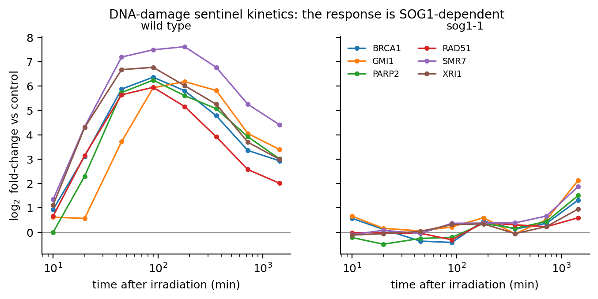
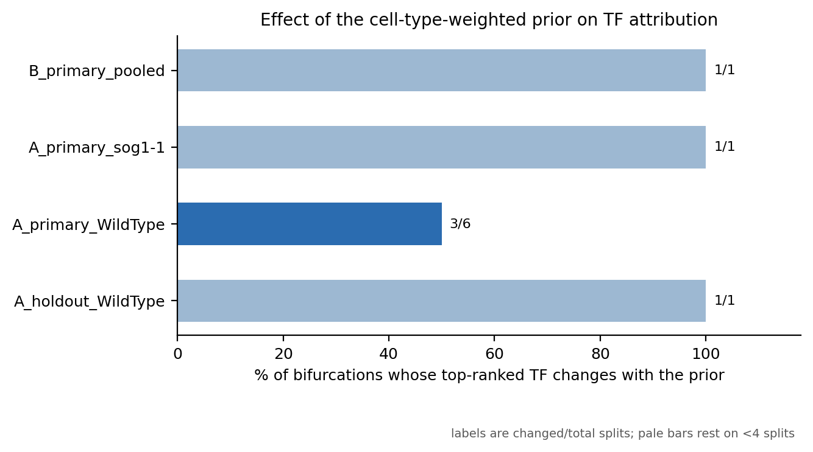

# arabidopsis-drem-osdr

Cross-study **pseudo-time-series** from NASA's Open Science Data Repository (OSDR),
modelled with the **Dynamic Regulatory Events Miner (DREM 2.0.7)**, with a single-cell
atlas acting **on the model** rather than on its annotation.

---

## What this does that DREM and iDREM do not

DREM finds bifurcations in a time-series and attributes each to the transcription factors
whose targets are enriched along one branch. That attribution depends on a static
TF–gene interaction prior which is normally **binary and tissue-blind**: an edge says a TF
*can* bind a promoter, not that the TF is present in the cells producing the signal.

iDREM accepts single-cell data, but its documentation is explicit that the cell-type data
"is not used when predicting the iDREM model" — it annotates finished nodes.

This pipeline moves that information upstream without modifying the engine. **DREM reads
the third column of its TF–gene file as a score in `[0,1]`, not as a binary flag**, and
that column is a sufficient channel: each timepoint is deconvolved against a 183-cluster
single-nucleus atlas, and every edge is re-weighted by whether its TF is expressed in the
cell types actually present.

The experiment is the ablation. Each arm is fitted three times under an identical search,
pinned seed and identical data, differing only in the prior:

| prior | column 3 | question it answers |
|---|---|---|
| `flat` | all edges `1.0` | what DREM normally gets |
| `binding` | DAP-seq / ChIP score | does binding confidence alone matter? |
| `weighted` | binding × cell-type context | does cell-type context change the attribution? |

If the weighted prior changes nothing, that is the finding and it is reported as such.

---

## The data

Screening all **62** *Arabidopsis thaliana* studies in OSDR for a parsable numeric time
axis and Illumina RNA-seq yields two cohorts. Every number below is measured by
`scripts/02_harmonise_metadata.py` and re-checked on each run, never asserted.

### Cohort A — γ-irradiation (primary)

**108 timed samples over 10 timepoints, 10 min → 72 h**, plus 36 untreated anchor samples.

| Study | Timepoints (min) | Genotypes | Role |
|---|---|---|---|
| OSD-498 | 10, 20, 90, 1440 | WT | core (`gIR vs mock wt`) |
| OSD-508 | 10, 20, 45, 90, 180, 360, 720, 1440 | WT, **sog1-1** | core (`t vs t0`) |
| OSD-510 | 20, 90, 180, 360, 720, 1440 | WT, **sog1-1** | core (`DREMmodel`) |
| OSD-782 | 60, 180, 1440, 4320 | WT | independent lab, low dose — **held out** |
| OSD-502 | — | WT, myb3r135 | repressor anchor (no time axis) |

**An honest statement of provenance.** OSD-498, OSD-508 and OSD-510 are three accessions
of *one* experiment — [Bourbousse, Vegesna & Law, *PNAS* 2018](https://doi.org/10.1073/pnas.1810582115),
who built their own DREM model over these data and reported **11 co-expressed gene
groups**. Assembling them is useful (it is how the 10 and 45 min timepoints join the 24 h
course) but it is **re-assembly, not integration**. The genuinely cross-study arm is
OSD-782 — which is also where the design is weakest, because it crosses a dose regime
(10–100 cGy against the core's high dose) and is therefore held out rather than pooled.

### Cohort B — spaceflight development (secondary)

**115 samples over 3 timepoints (4, 6, 8 d)**, four ecotypes, from OSD-193/218/281/437.
Reported as a generalisation test, not a co-equal result.

**OSD-219 is excluded**: all 32 of its BioSample IDs are identical to OSD-218's. The
duplicate is re-detected from sample-name overlap on every run rather than hard-coded, so
the exclusion cannot outlive the condition that justifies it.

---

## Results

**The response is SOG1-dependent, and the pipeline recovers that before any model is
fitted.** After batch harmonisation, all six canonical DNA-damage sentinels exceed 2-fold
induction in wild type — SMR7 rises from 1.34 (10 min) to 7.62 (3 h) and decays to 4.42
(24 h) — while in `sog1-1` only 4 reach 2-fold and RAD51 falls from 5.95 to 0.60. No step
in the harmonisation sees genotype, so this is the strongest available evidence that the
cross-study assembly measures biology rather than batch structure.



**DAP-seq does not contain SOG1.** The standard *Arabidopsis* binding atlas never assayed
the master regulator of the DNA-damage response. A DREM model built on it would produce a
complete, plausible, entirely SOG1-free attribution, and **nothing in the output would
signal the omission**. `scripts/04b_sog1_chip_prior.py` closes the gap by calling SOG1
peaks from the source study's own ChIP-seq (OSD-496 / GEO GSE112529) — 1,720 target genes,
requiring enrichment over *both* the matched input and the no-FLAG wild-type IP.
`04_fetch_tf_prior.py` now reports the presence of every key regulator on each run.

**The TF attribution reproduces the published regulatory logic.** Across all 12 models
(4 arms × 3 priors), SOG1 ranks **first of 479 scored TFs** in the wild-type model under
every prior, and collapses in the knockout:

| Prior | SOG1 rank, wild type | SOG1 rank, *sog1-1* |
|---|---|---|
| flat | **1** | 404 |
| binding | **1** | 6 |
| weighted | **1** | 574 |

MYB3R1 ranks 1–5 in wild type and is retained in the mutant, as expected for a repressor
whose activity does not depend on SOG1. This is the activator/repressor logic Bourbousse
et al. reported, recovered from an independently reconstructed pipeline — and only
possible because SOG1 edges were added from ChIP-seq.

**The prior changes marginal calls, not canonical ones.** Of 6 wild-type bifurcations,
3 change their top-ranked TF between priors. The three that *hold* are attributed to SOG1
(×2) and MYB3R1. The three that *move* are reassigned among WRKY33, TCP15, ANAC071, bZIP3
and MYB49 — the weaker calls. Only the wild-type arm resolved enough splits to read this
from; the other arms each resolved one.

**Independent corroboration.** The sibling repo `Plant_response_to_radiation` analyses
overlapping studies with a Gaussian-process autoencoder and WGCNA — no DREM, no TF
attribution. Over the 314 genes both modelled, **7 of 10 DREM nodes enrich a WGCNA module**
at Bonferroni-corrected *p* < 0.05.



---

## Layout

| Path | Contents |
|---|---|
| [`scripts/`](scripts/) | Numbered pipeline, `00`–`14`; `run_all.sh` runs the lot |
| [`data/`](data/) | Harmonised metadata and the TF prior (large inputs re-fetched, see `MANIFEST.tsv`) |
| [`results/`](results/) | Pseudo-time-series, cell-type fractions, DREM models, comparisons, and a QC report per stage |
| [`figures/`](figures/) | Rendered figures (PDF + PNG) |
| [`manuscript/`](manuscript/) | LaTeX source; `make pdf docx` builds both from it |

### Pipeline

```bash
bash scripts/run_all.sh --dry-run   # resolve every URL, download and fit nothing
bash scripts/run_all.sh             # full run
```

| Step | Does |
|---|---|
| `00_env_check.py` | Verifies Java, pandoc and LaTeX; prints the exact `brew` command for anything missing |
| `01_fetch_osdr.py` | Acquires counts + runsheets; file counts are **measured**, never asserted |
| `02_harmonise_metadata.py` | Builds the time axis; **five QC gates** that fail the run |
| `03_build_pseudotimeseries.py` | Within-study referencing, shared-timepoint offset removal, sentinel check |
| `04_fetch_tf_prior.py` | DAP-seq prior + symbol resolution; reports key-regulator coverage |
| `04b_sog1_chip_prior.py` | SOG1 edges from ChIP-seq with dual controls |
| `05_deconvolve_celltypes.py` | NNLS cell-type fractions + latent trajectories |
| `06_weight_tf_prior.py` | **The auto-decoder lever**; writes all three priors |
| `07`–`09` | DREM inputs → batch run → tidy tables |
| `10_compare_models.py` | Ablation, genotype contrast, published-model calibration |
| `12`–`14` | Figures, manuscript macros, `MANIFEST.tsv` |

---

## Reproducibility

- **Every manuscript number is generated.** `13_manuscript_numbers.py` writes
  `generated_numbers.tex` from `results/`; the prose only ever writes a macro. A value the
  pipeline has not produced renders a visible `TODO` in the PDF rather than a plausible
  stale figure.
- **Every citation is resolved against Crossref**, and `check_references.py` asserts the
  expected first author and year. This is not decoration: four DOIs written from memory
  during development resolved cleanly to *entirely different papers* (iDREM to a
  Gaussian-process paper, an *Arabidopsis* atlas to a *Drosophila* chromatin study). A
  resolve-only check passed all four. The author/year assertion is what catches them.
- **DREM is the real engine**, downloaded and checksummed rather than vendored, and the
  wrapper is validated against DREM's own bundled example before any study data is fitted.
- **QC reports are per stage** in `results/qc/`, and the gates fail the run rather than
  warn.

## Limitations

- The single-nucleus atlas is developmental and unirradiated; deconvolution assumes
  cell-type signatures are stable under γ-irradiation. That is an assumption, not a finding.
- Two biological replicates per genotype × timepoint cell in OSD-508/510.
- Cohort B pools four ecotypes; ecotype is uncontrolled within it.
- SOG1 peaks are called from bedGraph coverage by binned enrichment, because GEO
  distributes coverage rather than called peaks for GSE112529. The dual-control
  requirement makes the calls conservative but they are not a MACS analysis of raw reads.
- The atlas signature matrix covers 4,000 highly variable genes, so the lever re-weights
  the subset of edges where cell-type context exists. Genes outside that set are
  cell-type-invariant by construction and pass through unchanged;
  `scripts/build_full_signatures.R` widens this for users with R and the atlas object.

## Licence

Code MIT; data, figures and prose CC-BY-4.0. DREM is GPL-3.0 and is downloaded at run
time, not redistributed. NASA OSDR and GEO data retain their own terms — cite the original
investigators, listed in [`MANIFEST.tsv`](MANIFEST.tsv). See
[`LICENSE_NOTES.md`](LICENSE_NOTES.md).
